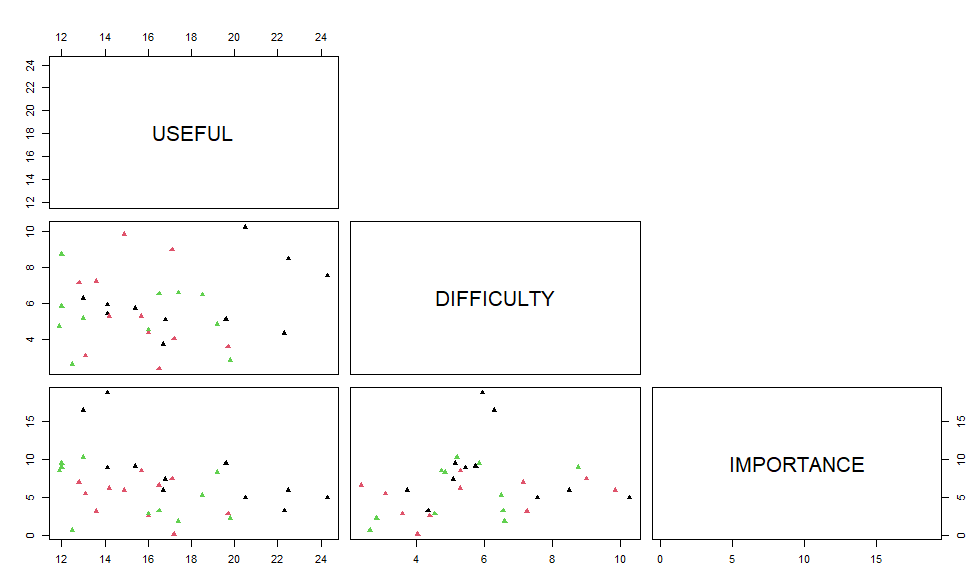
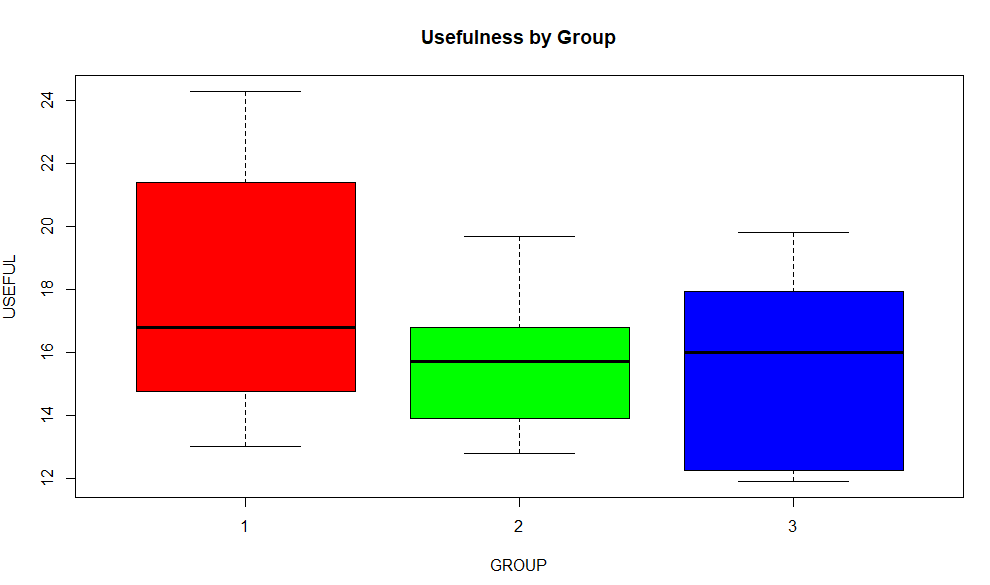
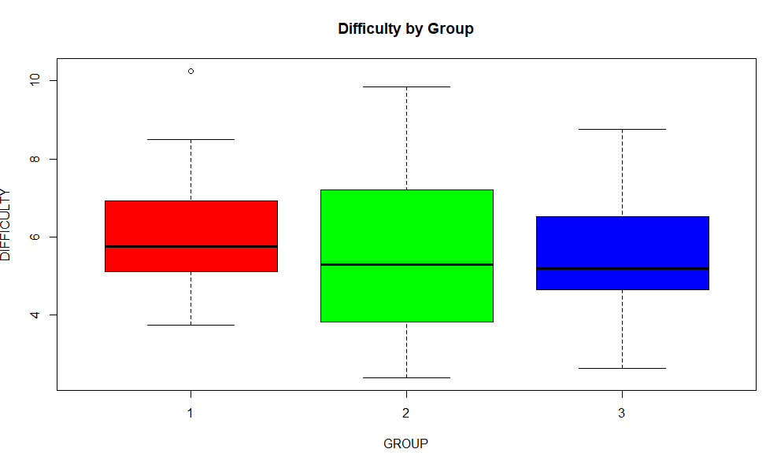
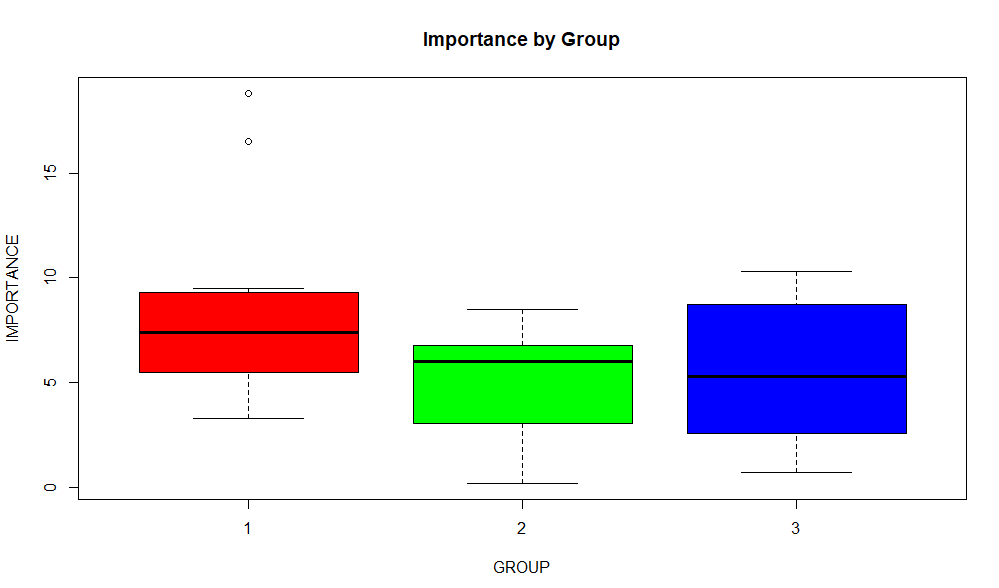

# MANOVA Analysis: Modes of Delivering Dietary Information

## Overview

A healthcare researcher examined whether the mode of delivering dietary
information influences patient perceptions.

Thirty-three participants were randomly assigned to one of three
groups: - Interactive online website - Nurse practitioner (in-person) -
Video recording of the same nurse practitioner

Each participant rated the presentation on: - Perceived Difficulty -
Usefulness - Importance

This analysis applies Multivariate Analysis of Variance (MANOVA) to
determine whether delivery mode affects the combined perception of these
three outcomes.

------------------------------------------------------------------------

## Objectives

1.  Visualize relationships between Difficulty, Usefulness, and
    Importance across groups
2.  Test MANOVA assumptions
3.  Perform one-way MANOVA
4.  Conduct post-hoc analysis if significant
5.  Interpret findings in a healthcare decision-making context

------------------------------------------------------------------------

## Data Structure

Independent Variable: - Delivery Mode (3 levels)

Dependent Variables: - USEFUL - DIFFICULTY - IMPORTANCE

Total sample size: n = 33

------------------------------------------------------------------------

# A) Visualizations

## Scatterplot Matrix

The scatterplot matrix visualizes pairwise relationships between: -
USEFUL - DIFFICULTY - IMPORTANCE

Key observations: - No strong linear relationships are visible. -
Relationships appear weak or possibly non-linear. - Group-specific
patterns may exist. - Differences are not clearly separable visually.

Interpretation: Group differences are not obvious from bivariate
relationships alone.

------------------------------------------------------------------------

## Boxplots by Group

Boxplots comparing each dependent variable across the three groups
reveal: - Means are generally similar across groups. - Groups 2 and 3
appear more similar to each other. - Group 1 shows some separation in
central tendency.

This suggests possible multivariate differences, particularly involving
Group 1.

------------------------------------------------------------------------

# B) MANOVA Assumption Testing

## 1. Multivariate Normality

Henze--Zirkler Test: - HZ = 0.628 - p-value = 0.441 - Multivariate
normality assumption satisfied.

------------------------------------------------------------------------

## 2. Homogeneity of Variance (Bartlett's Test)

USEFUL: - Chi-square = 3.5908 - p = 0.1661

DIFFICULTY: - Chi-square = 1.1477 - p = 0.5634

IMPORTANCE: - Chi-square = 3.9204 - p = 0.1408

Conclusion: No significant variance differences across groups.
Assumption supported.

------------------------------------------------------------------------

# C) One-Way MANOVA

## Hypotheses

Null Hypothesis (H0): μ1 = μ2 = μ3

Alternative Hypothesis (H1): At least one group mean vector differs.

------------------------------------------------------------------------

## Pillai's Trace Test

-   Pillai = 0.337
-   Approx F = 4.9217
-   Num Df = 3
-   Den Df = 29
-   p-value = 0.00695

Result: p \< 0.05

Conclusion: There is a statistically significant multivariate difference
between delivery modes.

------------------------------------------------------------------------

# Post-Hoc Analysis

## Before Multiple Comparison Correction

USEFUL: - F = 4.3033 - p = 0.0464

DIFFICULTY: - F = 0.9017 - p = 0.3497

IMPORTANCE: - F = 3.4589 - p = 0.0724

USEFUL initially appeared significant.

------------------------------------------------------------------------

## After Multiple Comparison Correction

USEFUL: - Adjusted p = 0.1393

DIFFICULTY: - Adjusted p = 1.0490

IMPORTANCE: - Adjusted p = 0.2173

After correction, none of the individual variables remain statistically
significant.

------------------------------------------------------------------------

# Interpretation

Key finding: The combined multivariate perception differs across
delivery modes.

No single variable independently explains the difference after
correction.

The effect appears subtle and distributed across multiple dimensions
rather than driven by a single outcome.

------------------------------------------------------------------------

# Healthcare Implications

1.  Delivery method influences patient perception in a multivariate
    sense.
2.  No single factor dominates the effect.
3.  Selection of delivery method should consider the holistic patient
    experience.
4.  Context, accessibility, and resource constraints remain important.
5.  Multidimensional evaluation is critical in healthcare communication
    strategies.

------------------------------------------------------------------------

# Technical Summary

-   Design: One-way MANOVA
-   Sample size: 33
-   Assumptions: Met
-   Test statistic: Pillai's Trace
-   Result: Significant multivariate group difference
-   Post-hoc: No significant univariate effects after correction

------------------------------------------------------------------------

# Final Conclusion

While individual measures (difficulty, usefulness, importance) do not
differ significantly when considered independently, the combined
perception profile varies by delivery mode.

Delivery format influences patient evaluation in a multidimensional way,
reinforcing the importance of multivariate statistical techniques in
healthcare research.
